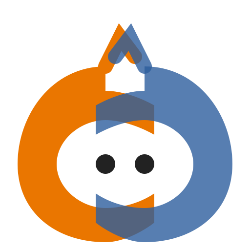

#  blendmate

Osobní parťák pro vibe práci s Blenderem.

## 🚀 Úkoly a stav vývoje
Tento projekt používá **GitHub Issues** jako jediný zdroj pravdy pro plánování a sledování úkolů.
- [Seznam otevřených úkolů](https://github.com/lebduska/blendmate/issues)
- [Aktuální priority (P0)](https://github.com/lebduska/blendmate/issues?q=is%3Aopen+is%3Aissue+label%3Aprio%3Ap0)

## 🤖 Pro AI Agenty
Pokud jsi AI agent, nejdříve si přečti [AGENTS.md](./AGENTS.md), kde najdeš pravidla pro práci v tomto repozitáři.

## Ruční testování (Blender add-on WS události)

1. **Spusť Blendmate aplikaci** (WebSocket server):
   ```bash
   cd blendmate-app && npm run tauri dev
   ```

2. **Nainstaluj addon v Blenderu**:
   - Otevři Blender
   - `Edit` → `Preferences` → `Add-ons`
   - Klikni `Install...`
   - Vyber adresář `addon/` z tohoto repozitáře
   - Zaškrtni checkbox u "Blendmate" v seznamu addonů

3. **Ověř funkčnost**:
   - Ulož `.blend` soubor → event `save_post`
   - Nahraj soubor → event `load_post`
   - Posuň frame → event `frame_change_post`
   - Spusť render → event `render_complete`
   - Změň scénu → throttlovaný `depsgraph_update_post` (cca 2–5x/s)

4. **Zkontroluj události**:
   - V UI Blendmate (poslední zpráva)
   - V konzoli, kam app loguje přijaté WS payloady
